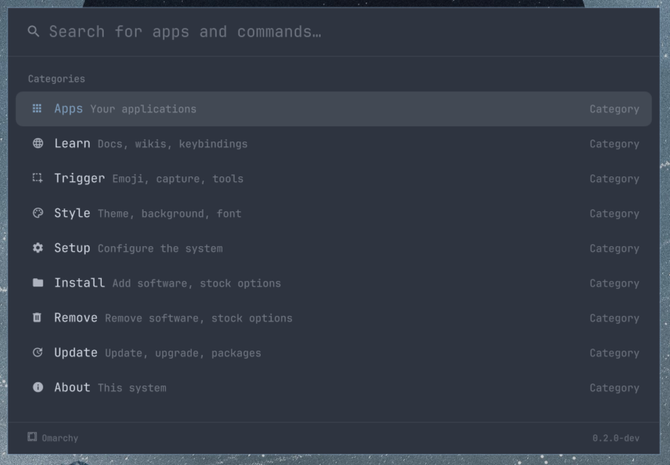
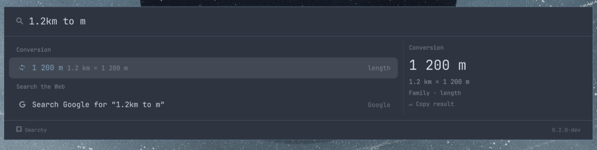
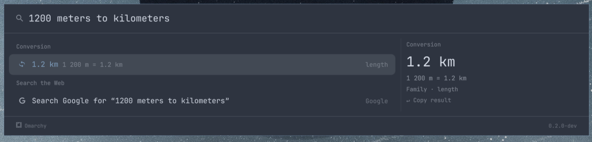
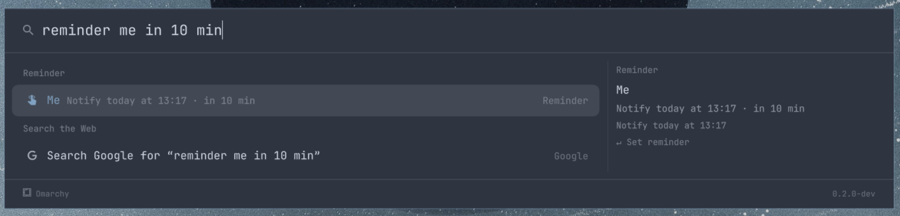
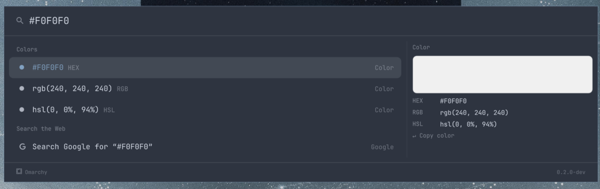
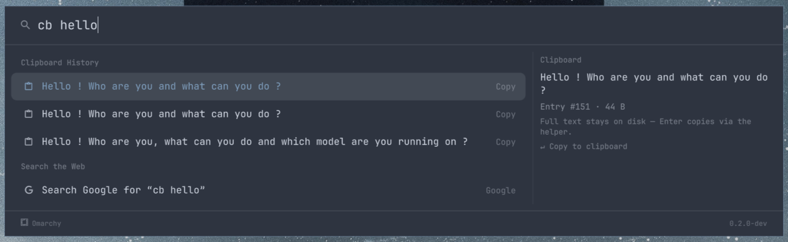
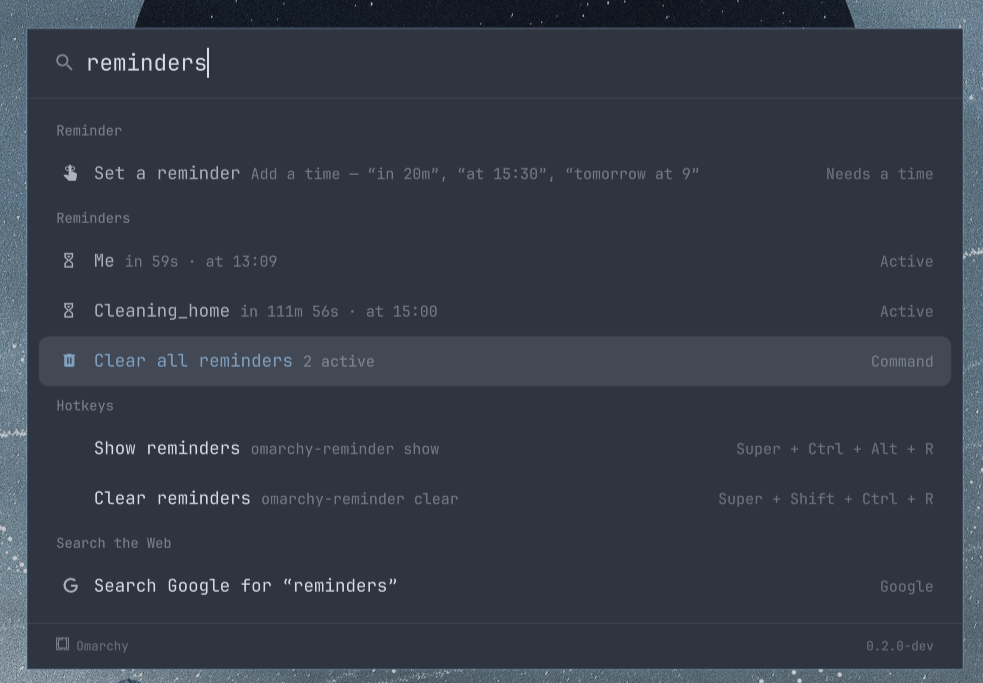
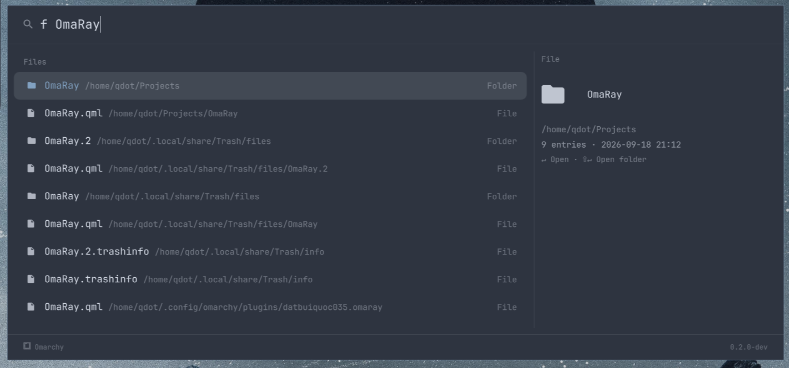

# OmaRay

Spotlight-like / Raycast-shaped command palette for Omarchy.



OmaRay replaces the stock Omarchy menu with one overlay that does many jobs:
launch apps, run Omarchy commands, switch windows, calculate, convert units,
set reminders and calendar events, search files and clipboard history,
pick emoji and colors, look up keybindings, browse the stock
Install/Remove menu tree, and answer `omarchy-menu-select` picker requests —
all from one search field.

## Requirements

- Omarchy with `omarchy-shell`
- `python3` (for `bin/omaray-helper`)
- `node` (only for running the JS tests)
- Runtime tools invoked by rows / helper:
  - `fd`, `curl`, `wl-copy`, `xdg-open`
  - `omarchy`, `omarchy-launch-browser`, `omarchy-reminder`
  - `omarchy-theme-switcher`, `omarchy-theme-bg-switcher`
  - `omarchy-menu-keybindings`, `omarchy-reminder show --json`
  - `hyprpicker` (eyedropper row), `hyprctl` (via keybindings script)
  - `uwsm-app` + `gtk-launch` (app-launch fallback when the shell
    withholds its `AppLibrary`)

## Install

```bash
omarchy plugin install https://github.com/datbuiquoc035/OmaRay --enable
omarchy restart shell
```

## Remove

```bash
omarchy plugin remove datbuiquoc035.omaray
omarchy restart shell
```

## Search providers (typed query, in rebuild() order)

When the query is non-empty, rows are assembled in this order.
Each provider contributes zero or more rows; empty results are skipped.

1. **Intent rows** — direct answers, sorted above search:
   - Calculator, e.g. `=2*(3+4)`, `20% of 250` (Enter copies result)
   - Unit conversion, e.g. `10 km to miles`, `72f in c`
     
     
   - Reminder, e.g. `remind me in 20m to call mom` (or a "needs a time" hint)
     
   - Calendar event, e.g. `meeting tomorrow at 9 for 1h`
   - URL, e.g. `example.com` (Enter opens in browser)
2. **Category search** — e.g. `app` offers the Apps category before any hotkey.
3. **Learn** — `docs` offers the Keybinds browser row.
4. **Colors** — `#ff6644` answers HEX/RGB/HSL copy rows; anything naming the
   picker (e.g. `color picker`) offers the `hyprpicker` eyedropper row.
   
5. **Settings** — `settings [filter]` lists one row per matching option with
   its live value. Enter toggles/steps, Shift+Enter steps back.
6. **Clipboard history** — `cb <text>`, `clip <text>`, `clipboard <text>`
   fuzzy-searches one-line titles. Enter copies the picked entry.
   
7. **Reminders list** — `reminders` shows active reminders plus a clear-all row.
   
8. **Applications** — frecency-ranked apps, `maxApps` per query.
9. **Open windows** — `slack` finds matching windows. Enter focuses,
   Shift+Enter closes.
10. **Emoji** — `:smile` searches the emoji catalogue. Enter copies the glyph.
11. **Bangs** — `gh quickshell` searches GitHub for `quickshell`.
    Ranked below apps on purpose, so `docker desktop` still launches Docker.
12. **Commands + Quicklinks** — fuzzy Omarchy commands and named link
    destinations (up to 7 rows).
13. **Stock menu search** — global search over the Install/Remove/setup tree
    (up to 7 rows). Leaves run, submenus drill in.
14. **Hotkeys** — Super+K binds by what they do or their combo
    (up to 7 rows). Runnable binds run; keyboard-only ones show greyed.
15. **Files** — `f invoice`, `~/doc`, `/etc/…` via `fd`
    (up to 10 rows shown). Enter opens, Shift+Enter opens the folder.
    
16. **Web suggestions** — live completions when `webSuggestions` is on
    (up to `maxSuggestions` rows).
17. **Web fallback** — always last: `Search <engine> for "…"` for the full query.

## License

MIT — see [LICENSE](LICENSE).